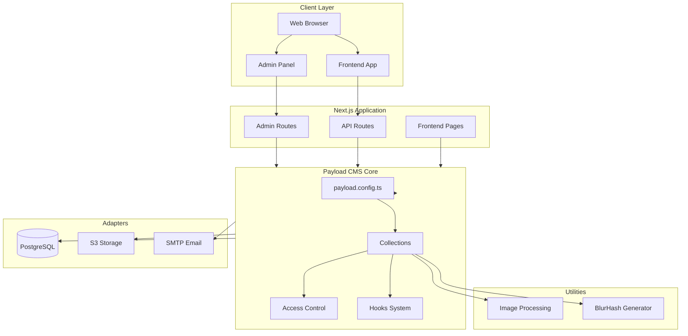
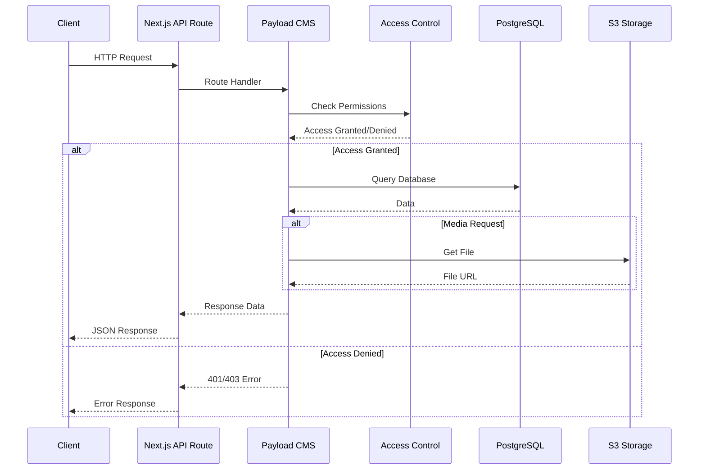
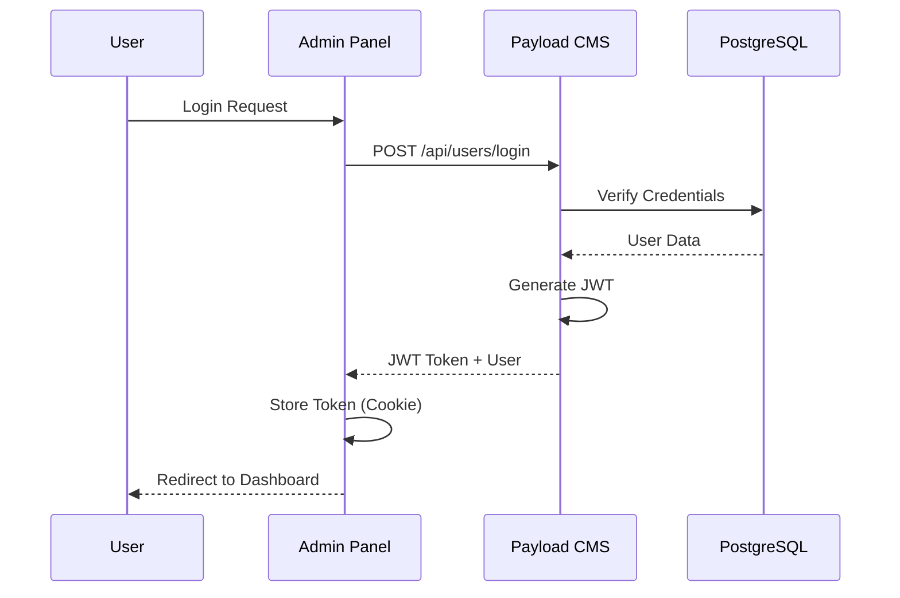
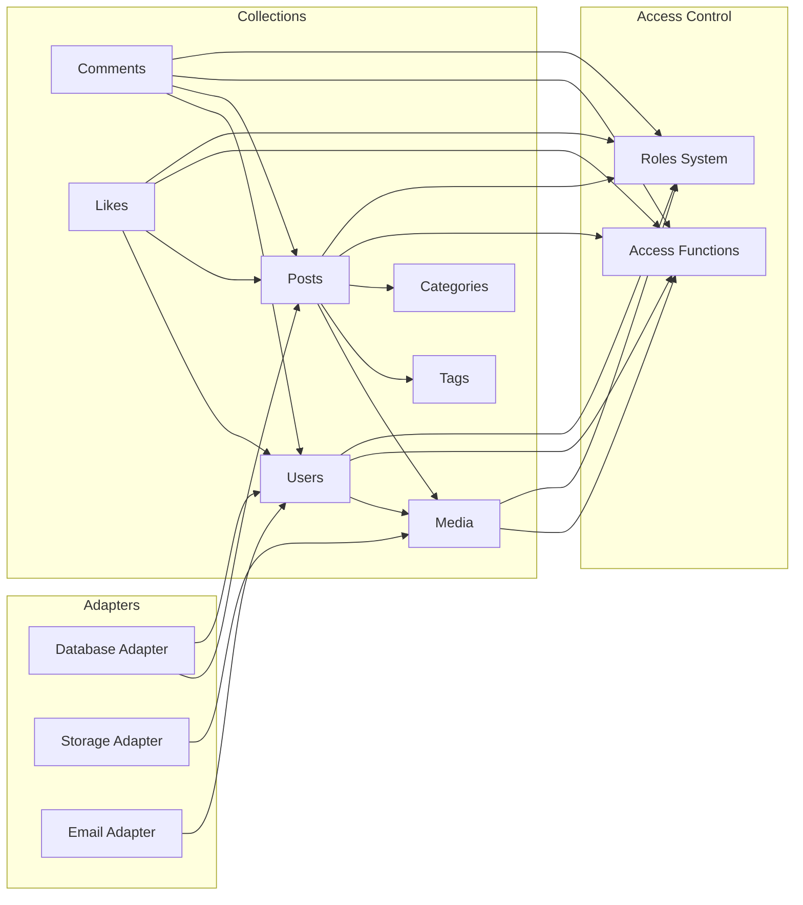
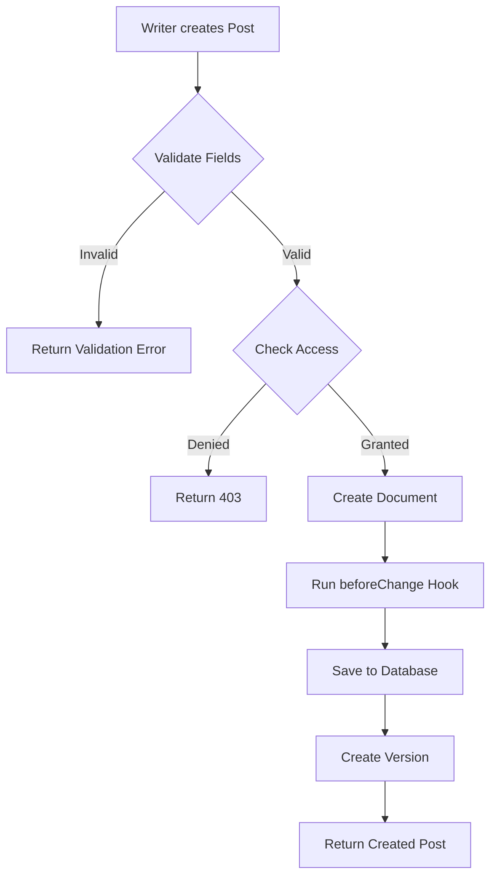
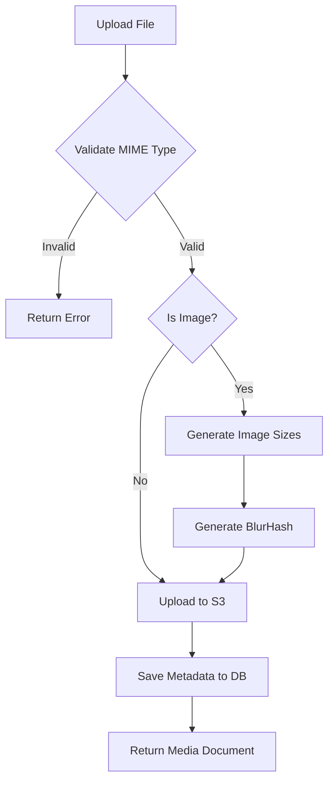
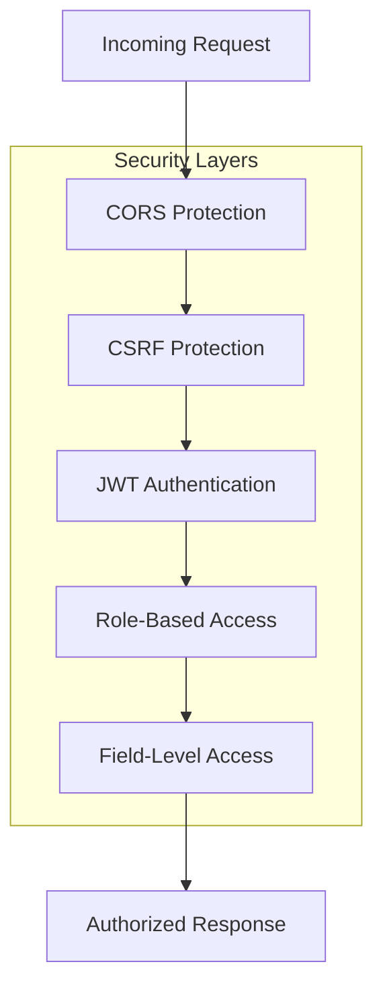

# 2. Kiến trúc hệ thống

## 2.1. System Architecture

## 2.2. Request Flow

### 2.2.1. API Request Flow

### 2.2.2. Authentication Flow

## 2.3. Component Relationships

## 2.4. Data Flow

### 2.4.1. Post Creation Flow

### 2.4.2. Media Upload Flow

## 2.5. Integration Points

### 2.5.1. Database Integration

- **Adapter**: `@payloadcms/db-postgres`
- **Connection**: PostgreSQL connection pool
- **Migrations**: Custom migration system trong `src/database/migrations/`
- **SSL**: Enabled trong production

### 2.5.2. Storage Integration

- **Adapter**: `@payloadcms/storage-s3`
- **Provider**: S3-compatible (Cloudflare R2)
- **Configuration**: Private ACL, path-style URLs
- **Collections**: Media collection only

### 2.5.3. Email Integration

- **Adapter**: `@payloadcms/email-nodemailer`
- **Protocol**: SMTP
- **Use Cases**: Email verification, password reset
- **Configuration**: Host, port, credentials từ environment

## 2.6. Security Architecture

## 2.7. Localization Architecture

- **Locales**: English (en), Vietnamese (vi)
- **Default**: English
- **Fallback**: Enabled
- **Fields**: Có thể mark fields là `localized: true`
- **Example**: User bio field hỗ trợ localization

## 2.8. Performance Considerations

### 2.8.1. Database

- Indexes trên các fields thường query (name, email, slug)
- Unique constraints để đảm bảo data integrity
- Connection pooling

### 2.8.2. Image Processing

- Lazy generation của image sizes
- WebP format cho smaller file sizes
- BlurHash cho progressive loading
- Sharp library cho efficient processing

### 2.8.3. Caching

- JWT tokens với expiration
- Static file serving từ S3/CDN
- Next.js built-in caching
