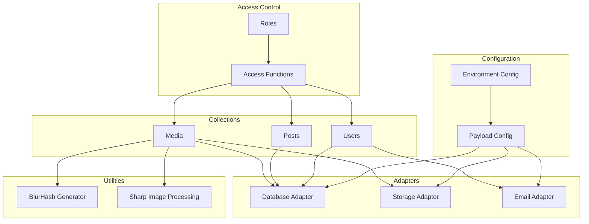

# 3. Components và Modules

## 3.1. Adapters

### 3.1.1. Database Adapter

**File**: `src/database/database.adapter.ts`

**Mô tả**: PostgreSQL adapter cho Payload CMS với migration support.

**Configuration**:

```typescript
postgresAdapter({
  pool: {
    connectionString: env.DATABASE_URL,
    ssl: env.NODE_ENV === 'production' ? { rejectUnauthorized: false } : undefined,
  },
  migrationDir: path.resolve(dirname, 'migrations'),
  prodMigrations: migrations,
  push: false,
})
```

**Features**:

- Connection pooling
- SSL support trong production
- Custom migration system
- Migration directory: `src/database/migrations/`

**Migrations**:

- `20260123_203533_create_users_and_media_collections`
- `20260123_205141_create_core_content_collections`

### 3.1.2. Storage Adapter

**File**: `src/config/adapters/storage.adapter.ts`

**Mô tả**: S3-compatible storage adapter cho media files (Cloudflare R2).

**Configuration**:

```typescript
s3Storage({
  collections: {
    media: {
      prefix: '', // No prefix for clean URLs
    },
  },
  bucket: env.S3_BUCKET_NAME,
  acl: 'private',
  config: {
    endpoint: env.S3_ENDPOINT,
    credentials: {
      accessKeyId: env.S3_ACCESS_KEY_ID,
      secretAccessKey: env.S3_SECRET_ACCESS_KEY,
    },
    region: env.S3_REGION,
    forcePathStyle: true, // For R2 and MinIO compatibility
  },
})
```

**Features**:

- S3-compatible API (R2, AWS S3, MinIO)
- Private ACL (no public-read)
- Path-style URLs
- No prefix cho clean URLs

**Supported Collections**:

- `media`: Images, videos, PDFs

### 3.1.3. Email Adapter

**File**: `src/config/adapters/smtp.adapter.ts`

**Mô tả**: SMTP email adapter sử dụng Nodemailer.

**Configuration**:

```typescript
nodemailerAdapter({
  defaultFromAddress: env.SMTP_FROM_ADDRESS,
  defaultFromName: env.SMTP_FROM_NAME,
  transportOptions: {
    host: env.SMTP_HOST,
    port: env.SMTP_PORT,
    secure: env.SMTP_SECURE,
    auth: {
      user: env.SMTP_USER,
      pass: env.SMTP_PASSWORD,
    },
  },
})
```

**Features**:

- SMTP protocol support
- Configurable secure connection (TLS/SSL)
- Default from address và name
- Used cho email verification

## 3.2. Access Control Functions

**File**: `src/access/index.ts`

### 3.2.1. Role Definitions

**File**: `src/access/roles.ts`

```typescript
export const ROLES = {
  ADMIN: 'admin',
  WRITER: 'writer',
  USER: 'user',
} as const
```

### 3.2.2. Access Functions

#### `isAdmin`

- **Type**: `Access`
- **Mô tả**: Kiểm tra user có role admin không
- **Usage**: Collection-level access control

#### `isAdminFieldLevel`

- **Type**: `FieldAccess`
- **Mô tả**: Kiểm tra user có role admin không (field-level)
- **Usage**: Field-level access control

#### `isAdminOrWriter`

- **Type**: `Access`
- **Mô tả**: Kiểm tra user có role admin hoặc writer không
- **Usage**: Create/update access cho content

#### `isAdminOrOwner`

- **Type**: `Access`
- **Mô tả**: Kiểm tra user có phải admin hoặc owner (createdBy) không
- **Logic**:
  - Admin: Always true
  - Others: Check `createdBy` field equals user.id
- **Usage**: Update/delete access cho user-generated content

#### `isSelfOrAdmin`

- **Type**: `Access`
- **Mô tả**: Kiểm tra user có phải chính mình hoặc admin không
- **Logic**:
  - No user: false
  - Admin: true
  - Others: Check `id` equals user.id
- **Usage**: User profile access

#### `isSelfOrAdminFieldLevel`

- **Type**: `FieldAccess`
- **Mô tả**: Field-level version của `isSelfOrAdmin`
- **Usage**: Field-level access (e.g., email field)

#### `readAccess`

- **Type**: `Access`
- **Mô tả**: Read access logic cho Posts
- **Logic**:
  - Admin/Writer: Read all (including drafts)
  - Others: Only published posts (`_status: 'published'`)
- **Usage**: Posts collection read access

## 3.3. Utilities

### 3.3.1. BlurHash Generator

**File**: `src/utils/generate-blur-hash-url.ts`

**Mô tả**: Utility để generate BlurHash cho images, dùng cho progressive image loading.

**Functions**:

#### `isEligibleForBlurHashUrl(mime?: string | null): boolean`

- Kiểm tra MIME type có phải image không (trừ SVG)
- Supported types: `image/jpeg`, `image/png`, `image/webp`, `image/avif`, `image/tiff`

#### `generateBlurHashUrl(buffer: Buffer): Promise<string | null>`

- Generate base64 BlurHash từ image buffer
- Sử dụng `plaiceholder` library
- Returns base64 string hoặc null nếu lỗi

**Usage**:

- Hook trong Media collection `beforeChange`
- Tự động generate khi upload image
- Store trong field `blurHashUrl`

### 3.3.2. Image Processing

**Library**: Sharp 0.34.2

**Configuration** trong `payload.config.ts`:

```typescript
import sharp from 'sharp'

export default buildConfig({
  sharp, // Enable Sharp for image processing
  // ...
})
```

**Features**:

- Automatic image optimization
- Multiple image sizes generation
- WebP format conversion
- Used trong Media collection upload config

## 3.4. Hooks System

### 3.4.1. Media Collection Hooks

**File**: `src/collections/media/config.ts`

#### `beforeChange` Hook

**Mục đích**: Generate BlurHash cho images khi upload.

**Logic**:

1. Check nếu có file mới upload
2. Check MIME type có phải image không
3. Generate BlurHash từ file buffer
4. Store trong `blurHashUrl` field
5. Log success/error

**Code Flow**:

```typescript
beforeChange: [
  async ({ data, req }) => {
    const file = req.file

    if (!file || !isEligibleForBlurHashUrl(file.mimetype)) {
      data.blurHashUrl = null
      return data
    }

    try {
      const base64 = await generateBlurHashUrl(file.data)
      if (base64) {
        data.blurHashUrl = base64
        req.payload.logger.info(`Generated blurhash for image: ${file.name}`)
      }
    } catch (error) {
      req.payload.logger.error({
        msg: 'Failed to generate blurhash',
        error,
        file: file.name,
      })
    }

    return data
  },
]
```

## 3.5. Environment Configuration

**File**: `src/config/env/index.ts`

**Mô tả**: Environment variables validation sử dụng Zod và `@t3-oss/env-nextjs`.

**Server Variables**:

- `NODE_ENV`: development | test | production
- `DATABASE_URL`: PostgreSQL connection string
- `PAYLOAD_SECRET`: Secret key (min 32 chars)
- `PAYLOAD_JWT_EXPIRATION`: JWT expiration time
- `S3_*`: S3 storage configuration
- `SMTP_*`: SMTP email configuration

**Client Variables**:

- `NEXT_PUBLIC_APP_URL`: Application URL
- `NEXT_PUBLIC_API_URL`: API URL
- `NEXT_PUBLIC_S3_PUBLIC_URL`: Public S3 URL

**Features**:

- Type-safe environment access
- Runtime validation
- Skip validation option (for CI/CD)
- Empty string as undefined

## 3.6. Component Interaction



## 3.7. Dependencies

### Core Dependencies

- `payload`: CMS framework
- `@payloadcms/db-postgres`: PostgreSQL adapter
- `@payloadcms/storage-s3`: S3 storage adapter
- `@payloadcms/email-nodemailer`: Email adapter
- `@payloadcms/richtext-lexical`: Rich text editor

### Utility Dependencies

- `sharp`: Image processing
- `plaiceholder`: BlurHash generation
- `zod`: Schema validation
- `@t3-oss/env-nextjs`: Environment validation
