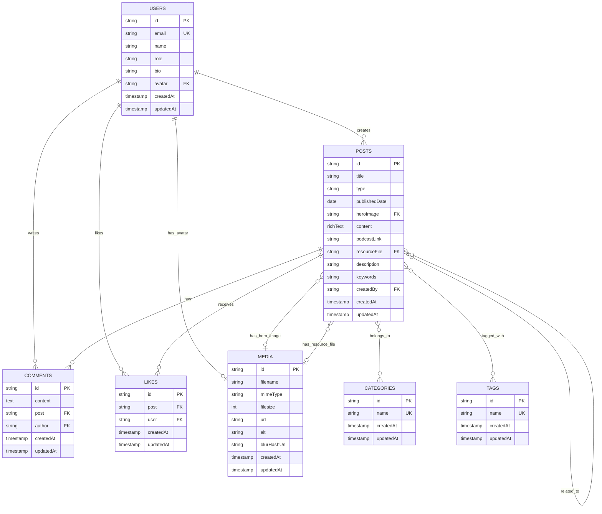

# 4. Data Models

## 4.1. Entity Relationship Diagram



## 4.2. Users Collection

**Slug**: `users`

**Type**: Authentication Collection

### Schema

| Field       | Type      | Required | Unique | Indexed | Description                      |
| ----------- | --------- | -------- | ------ | ------- | -------------------------------- |
| `id`        | string    | ✅       | ✅     | ✅      | Auto-generated UUID              |
| `email`     | email     | ✅       | ✅     | ✅      | User email (login)               |
| `name`      | text      | ✅       | ❌     | ✅      | Display name                     |
| `role`      | select    | ✅       | ❌     | ❌      | admin, writer, user              |
| `bio`       | textarea  | ❌       | ❌     | ❌      | User biography (localized)       |
| `avatar`    | upload    | ❌       | ❌     | ❌      | Avatar image (relationTo: media) |
| `createdAt` | timestamp | ✅       | ❌     | ❌      | Auto-generated                   |
| `updatedAt` | timestamp | ✅       | ❌     | ❌      | Auto-updated                     |

### Authentication Configuration

```typescript
auth: {
  tokenExpiration: Number(env.PAYLOAD_JWT_EXPIRATION), // 3 hours default
  verify: true, // Email verification required
  maxLoginAttempts: 5,
  lockTime: 600 * 1000, // 10 minutes
  cookies: {
    secure: env.NODE_ENV === 'production',
    sameSite: 'Lax',
  },
}
```

### Access Control

- **Read**: Public (all users)
- **Create**: Public (registration)
- **Update**: Self or Admin
- **Delete**: Admin only
- **Email field**: Self or Admin (field-level)

### Role Options

- `admin`: Full access
- `writer`: Can create/update content
- `user`: Basic user (default)

## 4.3. Posts Collection

**Slug**: `posts`

**Type**: Content Collection với Draft/Version support

### Schema

| Field           | Type         | Required | Description                            |
| --------------- | ------------ | -------- | -------------------------------------- |
| `id`            | string       | ✅       | Auto-generated UUID                    |
| `title`         | text         | ✅       | Post title                             |
| `type`          | select       | ✅       | blog, podcast, resource                |
| `publishedDate` | date         | ❌       | Publication date                       |
| `heroImage`     | upload       | ❌       | Hero image (relationTo: media)         |
| `content`       | richText     | ❌       | Main content (Lexical editor)          |
| `podcastLink`   | text         | ❌       | External podcast link (conditional)    |
| `resourceFile`  | upload       | ❌       | PDF resource file (conditional)        |
| `description`   | textarea     | ❌       | Meta description                       |
| `keywords`      | text         | ❌       | Meta keywords                          |
| `categories`    | relationship | ❌       | Many-to-many với categories            |
| `tags`          | relationship | ❌       | Many-to-many với tags                  |
| `relatedPosts`  | relationship | ❌       | Many-to-many với posts (excludes self) |
| `createdBy`     | relationship | ✅       | Auto-set (relationTo: users)           |
| `_status`       | select       | ✅       | draft, published (auto-managed)        |
| `createdAt`     | timestamp    | ✅       | Auto-generated                         |
| `updatedAt`     | timestamp    | ✅       | Auto-updated                           |

### Post Types

1. **Blog Post** (`blog`)
   - Standard blog post với rich text content
   - Hero image optional

2. **Podcast** (`podcast`)
   - External podcast link required
   - Hero image optional

3. **Resource** (`resource`)
   - Downloadable PDF file required
   - Hero image optional

### Conditional Fields

- `podcastLink`: Only shown when `type === 'podcast'`
- `resourceFile`: Only shown when `type === 'resource'`

### Access Control

- **Read**:
  - Admin/Writer: All posts (including drafts)
  - Others: Only published posts
- **Create**: Admin or Writer
- **Update**: Admin or Owner (createdBy)
- **Delete**: Admin or Owner

### Versioning

- **Drafts**: Enabled
- **Versions**: Auto-created on save
- **Status**: `draft` or `published`

## 4.4. Categories Collection

**Slug**: `categories`

**Type**: Taxonomy Collection

### Schema

| Field       | Type      | Required | Unique | Indexed | Description         |
| ----------- | --------- | -------- | ------ | ------- | ------------------- |
| `id`        | string    | ✅       | ✅     | ✅      | Auto-generated UUID |
| `name`      | text      | ✅       | ✅     | ✅      | Category name       |
| `createdAt` | timestamp | ✅       | ❌     | ❌      | Auto-generated      |
| `updatedAt` | timestamp | ✅       | ❌     | ❌      | Auto-updated        |

### Access Control

- **Read**: Public
- **Create**: Admin or Writer
- **Update**: Admin or Writer
- **Delete**: Admin only

## 4.5. Tags Collection

**Slug**: `tags`

**Type**: Tagging Collection

### Schema

| Field       | Type      | Required | Unique | Description |
| ----------- | --------- | -------- | ------ | ----------- | ------------------- |
| `id`        | string    | ✅       | ✅     | ✅          | Auto-generated UUID |
| `name`      | text      | ✅       | ✅     | ❌          | Tag name            |
| `createdAt` | timestamp | ✅       | ❌     | ❌          | Auto-generated      |
| `updatedAt` | timestamp | ✅       | ❌     | ❌          | Auto-updated        |

### Access Control

- **Read**: Public
- **Create**: Admin or Writer
- **Update**: Admin or Writer
- **Delete**: Admin only

## 4.6. Comments Collection

**Slug**: `comments`

**Type**: User-Generated Content

### Schema

| Field       | Type         | Required | Description                                  |
| ----------- | ------------ | -------- | -------------------------------------------- |
| `id`        | string       | ✅       | Auto-generated UUID                          |
| `content`   | textarea     | ✅       | Comment text                                 |
| `post`      | relationship | ✅       | Related post (relationTo: posts)             |
| `author`    | relationship | ✅       | Comment author (relationTo: users, auto-set) |
| `createdAt` | timestamp    | ✅       | Auto-generated                               |
| `updatedAt` | timestamp    | ✅       | Auto-updated                                 |

### Access Control

- **Read**: Public
- **Create**: Authenticated users only
- **Update**: Admin or Owner (author)
- **Delete**: Admin or Owner

### Admin Panel

- Hidden from non-admin users
- Default columns: content, author, post, createdAt

## 4.7. Likes Collection

**Slug**: `likes`

**Type**: Binary Like System

### Schema

| Field       | Type         | Required | Description                                  |
| ----------- | ------------ | -------- | -------------------------------------------- |
| `id`        | string       | ✅       | Auto-generated UUID                          |
| `post`      | relationship | ✅       | Liked post (relationTo: posts)               |
| `user`      | relationship | ✅       | User who liked (relationTo: users, auto-set) |
| `createdAt` | timestamp    | ✅       | Auto-generated                               |
| `updatedAt` | timestamp    | ✅       | Auto-updated                                 |

### Constraints

- **Unique Index**: `(post, user)` - Một user chỉ có thể like một post một lần
- **Update**: Disabled (likes are binary: create = like, delete = unlike)

### Access Control

- **Read**: Public
- **Create**: Authenticated users only
- **Update**: Disabled
- **Delete**: Admin or Owner (user)

### Admin Panel

- Hidden from non-admin users
- Default columns: post, user, createdAt

## 4.8. Media Collection

**Slug**: `media`

**Type**: Upload Collection với Image Processing

### Schema

| Field         | Type      | Required | Description                      |
| ------------- | --------- | -------- | -------------------------------- |
| `id`          | string    | ✅       | Auto-generated UUID              |
| `filename`    | text      | ✅       | Original filename                |
| `mimeType`    | text      | ✅       | File MIME type                   |
| `filesize`    | number    | ✅       | File size in bytes               |
| `url`         | text      | ✅       | Public URL (S3)                  |
| `alt`         | text      | ✅       | Alt text for images              |
| `blurHashUrl` | text      | ❌       | Base64 BlurHash (auto-generated) |
| `createdAt`   | timestamp | ✅       | Auto-generated                   |
| `updatedAt`   | timestamp | ✅       | Auto-updated                     |

### Upload Configuration

```typescript
upload: {
  staticDir: 'media',
  formatOptions: {
    format: 'webp',
    options: { quality: 80 },
  },
  adminThumbnail: 'adminThumbnail',
  mimeTypes: [
    'image/jpeg', 'image/png', 'image/webp', 'image/avif',
    'application/pdf',
    'video/mp4', 'video/webm', 'video/ogg', 'video/quicktime',
  ],
  imageSizes: [
    { name: 'adminThumbnail', width: 150, height: 150 },
    { name: 'thumbnail', width: 400, height: 400 },
    { name: 'card', width: 768, height: undefined },
    { name: 'featured', width: 1200, height: 675 },
  ],
}
```

### Image Sizes

1. **adminThumbnail**: 150x150px (admin panel)
2. **thumbnail**: 400x400px (thumbnails)
3. **card**: 768px width (maintains aspect ratio)
4. **featured**: 1200x675px (16:9 ratio)

### Supported File Types

- **Images**: JPEG, PNG, WebP, AVIF
- **Documents**: PDF
- **Videos**: MP4, WebM, OGG, QuickTime

### BlurHash Generation

- Auto-generated cho images trong `beforeChange` hook
- Stored trong `blurHashUrl` field
- Used cho progressive image loading

### Access Control

- **Read**: Public
- **Create**: Admin or Writer
- **Update**: Admin or Owner
- **Delete**: Admin or Owner

## 4.9. Relationships Summary

| From     | To         | Type         | Field          | Description        |
| -------- | ---------- | ------------ | -------------- | ------------------ |
| Users    | Media      | One-to-Many  | `avatar`       | User avatar image  |
| Posts    | Media      | One-to-Many  | `heroImage`    | Post hero image    |
| Posts    | Media      | One-to-Many  | `resourceFile` | Resource PDF file  |
| Posts    | Categories | Many-to-Many | `categories`   | Post categories    |
| Posts    | Tags       | Many-to-Many | `tags`         | Post tags          |
| Posts    | Posts      | Many-to-Many | `relatedPosts` | Related posts      |
| Comments | Posts      | Many-to-One  | `post`         | Commented post     |
| Comments | Users      | Many-to-One  | `author`       | Comment author     |
| Likes    | Posts      | Many-to-One  | `post`         | Liked post         |
| Likes    | Users      | Many-to-One  | `user`         | User who liked     |
| Posts    | Users      | Many-to-One  | `createdBy`    | Post author (auto) |

## 4.10. Indexes

### Users

- `email`: Unique index
- `name`: Index

### Categories

- `name`: Unique index

### Tags

- `name`: Unique index

### Likes

- `(post, user)`: Unique composite index

## 4.11. Timestamps

Tất cả collections đều có:

- `createdAt`: Auto-generated timestamp
- `updatedAt`: Auto-updated timestamp

Enabled via `timestamps: true` trong collection config (default).
